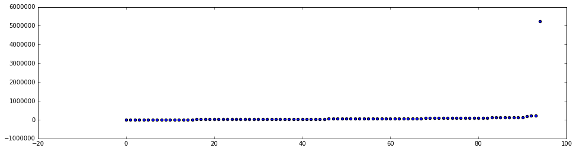
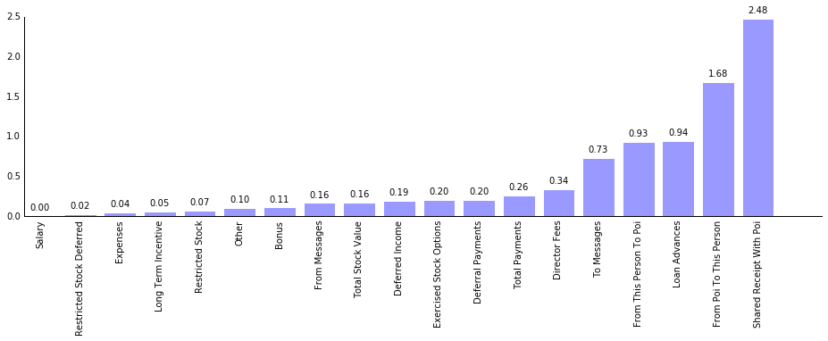
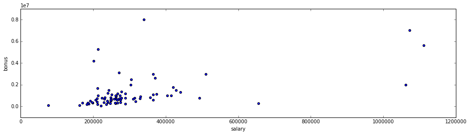

##P05: Identify Fraud from Enron Email

In 2000, Enron was one of the largest companies in the United States. By 2002, it had collapsed into bankruptcy due to widespread corporate fraud. In the resulting Federal investigation, a significant amount of typically confidential information entered into the public record, including tens of thousands of emails and detailed financial data for top executives.

In this project, I have analyzed financial and email data with the goal of identifying people of interest for the investigation of the Enron scandal.

[Check Wikipedia entry on Enron Corporation](https://en.wikipedia.org/wiki/Enron)

##### What features did you end up using in your POI identifier, and what selection process did you use to pick them? Did you have to do any scaling? Why or why not? As part of the assignment, you should attempt to engineer your own feature that does not come ready-made in the dataset -- explain what feature you tried to make, and the rationale behind it. (You do not necessarily have to use it in the final analysis, only engineer and test it.) In your feature selection step, if you used an algorithm like a decision tree, please also give the feature importances of the features that you use, and if you used an automated feature selection function like SelectKBest, please report the feature scores and reasons for your choice of parameter values.  [relevant rubric items: “create new features”, “properly scale features”, “intelligently select feature”]

#### Outlier removal

While analyzing Expenses using the plot below, an outlier was identified.
The plot shows the values of expenses per person.
Apparently 'TOTAL' was stored as a person.



#### Feature Engineering

Feature selection was performed using the automated function *SelectKBest*.
The result of the analysis is shown in the Figure below.



From this analysis we select the 10 top features:

- exercised\_stock\_options
- total\_stock\_value
- bonus
- salary
- salary\_bonus\_ratio
- deferred\_income
- long\_term\_incentive
- restricted\_stock
- total\_payments
- shared\_receipt\_with\_poi
- loan\_advances

Since some of these features might be correlated, we are going to evaluate models using different feature sets generated from this top10.

##### Feature extraction


A very simple feature was created from the original dataset.
The plot below illustrates the correlation between Bonus and Salary.



It is interesting to note that some employees have a really high bonus when comparing to their own salary.
Thus, the feature 'salary\_bonus\_ratio' was created to measure the ratio between bonus and salary.

```
person['bonus']/person['salary']
```

##### What algorithm did you end up using? What other one(s) did you try? How did model performance differ between algorithms?  [relevant rubric item: “pick an algorithm”]

**Three** algorithms were used to generate models of Person Of Interest (POI):

- [Gaussian Naive Bayes](http://scikit-learn.org/stable/modules/generated/sklearn.naive_bayes.GaussianNB.html#sklearn.naive_bayes.GaussianNB)
- [Random Forest with 100 trees](http://scikit-learn.org/stable/modules/generated/sklearn.ensemble.RandomForestClassifier.html#sklearn.ensemble.RandomForestClassifier)
- [Quadratic Discriminant Analysis](http://scikit-learn.org/stable/modules/generated/sklearn.discriminant_analysis.QuadraticDiscriminantAnalysis.html#sklearn.discriminant_analysis.QuadraticDiscriminantAnalysis)

Several subsets of the feature set were experimented by generating subsets of size 2,3,4, and 5.
This optimization used the following evaluation function for the resultant model:

\begin{function}
f(x) = Precision+1.2*Recall+1-abs(Precision-Recall)
\end{function}

The idea was to promote models with good precision and recall. However we want to emphasize recall (using a 1.2 factor) while having a small difference between the two measures. 

The idea of giving more relevance to *Recall* is because in the investigation we would rather have False Positives (i.e., people that are not of interest but were falsely identified) than False Negatives (i.e., people that are of interest and will not be indicated for investigation by our model).

Some machine learning algorithms are highly sensible to parameters (e.g., SVMs).
In these case, we do not have such kind of algorithms.
We have tuned Random Forest to 100 trees, since this is a common setting for this algorithm.
If you wanted to tune a algorithm we would try tunning the algorithm with a set of different settings, perhaps using a grid search.

The best model was produced using **Gaussian Naive Bayes** with the following feature set:

- long\_term\_incentive
- deferred\_income
- total\_stock\_value
- exercised\_stock\_options

The performance of this model is in the Table below.

Metric | Value
---|---
Recall | 0.67   
Precision | 0.67
F1 | 0.67 

This model has a recall of 0.67 meaning that we expect that we are only able to detect 67% of people that actually is of interest.
A precision of 0.67, meaning that we expect that 67% of people indicated as POI will actually be a POI.


##### Model Validation

Two distinct sets were extracted from the original dataset --- train set and test set --- using a random split of 70% and 30% proportion, respectively.
This is an important step since, a common mistake is using data in the test phase that was already used to create the model, leading to **overfitting**.

----
**Note:** Further details about the data exploration can be found in the IPython Notebook ```Data exploration.ipynb```
