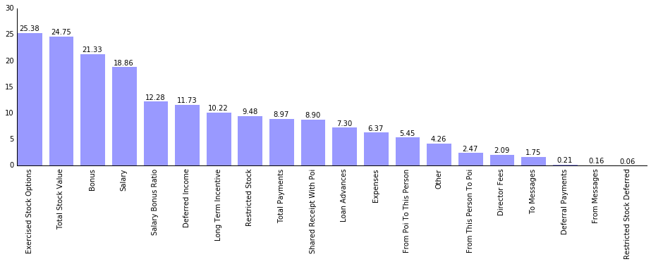

##P05: Identify Fraud from Enron Email

In 2000, Enron was one of the largest companies in the United States. By 2002, it had collapsed into bankruptcy due to widespread corporate fraud. In the resulting Federal investigation, a significant amount of typically confidential information entered into the public record, including tens of thousands of emails and detailed financial data for top executives.

In this project, I have analyzed financial and email data with the goal of identifying people of interest for the investigation of the Enron scandal.

[Check Wikipedia entry on Enron Corporation](https://en.wikipedia.org/wiki/Enron)

##### What features did you end up using in your POI identifier, and what selection process did you use to pick them? Did you have to do any scaling? Why or why not? As part of the assignment, you should attempt to engineer your own feature that does not come ready-made in the dataset -- explain what feature you tried to make, and the rationale behind it. (You do not necessarily have to use it in the final analysis, only engineer and test it.) In your feature selection step, if you used an algorithm like a decision tree, please also give the feature importances of the features that you use, and if you used an automated feature selection function like SelectKBest, please report the feature scores and reasons for your choice of parameter values.  [relevant rubric items: “create new features”, “properly scale features”, “intelligently select feature”]


#### Dataset description

The dataset has 21 features, including the label POI, for 146 data points.
Some features provide NaN:

Feature | Missing values
---|---
salary | 51
to\_messages | 59
deferral\_payments | 107
total\_payments | 21
exercised\_stock\_options | 44
bonus | 64
restricted\_stock | 36
shared\_receipt\_with\_poi | 59
restricted\_stock\_deferred | 128
total\_stock\_value | 20
expenses | 51
loan\_advances | 142
from\_messages | 59
other | 53
from\_this\_person\_to\_poi | 59
director\_fees | 129
deferred\_income | 97
long\_term\_incentive | 80
email\_address | 34
from\_poi\_to\_this\_person | 59

Allocation across classes POI and Non POI is illustrated in the Figure below. Data is unbalanced, since we have considerably more data points for non POIs. This is an important characteristic since metrics such as accuracy are not suitable for model evaluation. In addition, Stratified Shuffle Split should be used to split data in train and test sets, to make sure the ratio of POI and non-POI is the same during training and testing.


#### Outlier removal

While analyzing Expenses using the plot below, an outlier was identified.
The plot shows the values of expenses per person.
Apparently 'TOTAL' was stored as a person.


#### Feature Engineering

##### Feature extraction


A very simple feature was created from the original dataset.
The plot below illustrates the correlation between Bonus and Salary.


It is interesting to note that some employees have a really high bonus when comparing to their own salary.
Thus, the feature 'salary\_bonus\_ratio' was created to measure the ratio between bonus and salary.

```
person['bonus']/person['salary']
```

##### Feature scaling

Some algorithms are sensitive to feature scaling.
Common feature scaling techniques are *standardization* and *normalization*.
I did not implement feature scaling since the algorithms I've used in this study did not require it.

##### Feature Selection

Feature selection was performed using the automated function *SelectKBest*.
The result of the analysis is shown in the Figure below.



From this analysis we select the 10 top features:

- exercised\_stock\_options
- total\_stock\_value
- bonus
- salary
- salary\_bonus\_ratio
- deferred\_income
- long\_term\_incentive
- restricted\_stock
- total\_payments
- shared\_receipt\_with\_poi
- loan\_advances

Although I've selected 10 features this is not going to be our final feature set.
Since some of these features might be correlated, I evaluate models using different feature sets generated from this top10.
I.e., for every combination of features with length from 2 to 5, a model was generated and evaluated. E.g., try {exercised\_stock\_options, total\_stock\_value} then {exercised\_stock\_options, bonus}, and so on. This procedure explained in more detail later in this document.


##### What algorithm did you end up using? What other one(s) did you try? How did model performance differ between algorithms?  [relevant rubric item: “pick an algorithm”]

**Two** algorithms were used to generate models of Person Of Interest (POI):

- [Gaussian Naive Bayes](http://scikit-learn.org/stable/modules/generated/sklearn.naive_bayes.GaussianNB.html#sklearn.naive_bayes.GaussianNB)
- [Quadratic Discriminant Analysis](http://scikit-learn.org/stable/modules/generated/sklearn.discriminant_analysis.QuadraticDiscriminantAnalysis.html#sklearn.discriminant_analysis.QuadraticDiscriminantAnalysis)

Several subsets of the feature set were experimented by generating subsets of size 2,3,4, and 5.
This optimization used the following evaluation function for the resultant model:

```
f(x) = Precision+1.2*Recall+1-abs(Precision-Recall)
```

The idea was to promote models with good precision and recall. However we want to emphasize recall (using a 1.2 factor) while having a small difference between the two measures. 

The idea of giving more relevance to *Recall* is because in the investigation we would rather have False Positives (i.e., people that are not of interest but were falsely identified) than False Negatives (i.e., people that are of interest and will not be indicated for investigation by our model).

##### Train and test sets

When evaluating models, an important step is splitting data in training and test set. Data points used to train a model should never be used to evaluate the model. Ignoring this can lead to **overfitting**.
Thus, I have used Stratified Shuffle Splitting with a 70/30 split (i.e., 70% of data was used for training and 30% for testing). In addition, we repeated this technique in 3 iterations, allowing to evaluate algorithms with different data.

Two distinct sets were extracted from the original dataset --- train set and test set --- using a random split of 70% and 30% proportion, respectively.
This is an important step since, a common mistake is using data in the test phase that was already used to create the model, leading to .

##### Parameter Tuning

Some machine learning algorithms are highly sensitive to parameters (e.g., SVMs).
Thus, it is important to make sure the algorithm is executed with the set of parameters that are optimal for the given problem.
This can be implemented using a *Grid Search* in which the same algorithm is consecutively experimented with different settings.
The optimal set of parameters is selected from the model that had the best performance.
Performance metrics can be *Recall*, *Precision*, or *F1*.
In this study, I have not included algorithms that would benefit from parameter tuning.

##### Results of the algorithm and feature selection

The best model was produced using **Gaussian Naive Bayes** with the following feature set:

- long\_term\_incentive
- deferred\_income
- salary
- total\_stock\_value

The performance of this model is in the Table below.

Metric | Value
---|---
Recall | 0.60   
Precision | 0.69
F1 | 0.64 

This model has a recall of 0.60 meaning that we expect that we are only able to detect 60% of people that actually is of interest.
A precision of 0.69, meaning that we expect that 69% of people indicated as POI will actually be a POI.

##### Validation results

I have executed the selected model with the validation dataset by running the script ```./src/tester.py```.
I got the following results:

```
GaussianNB()
  Accuracy: 0.85914	Precision: 0.50916	Recall: 0.38900
  F1: 0.44104	F2: 0.40827
  Total predictions: 14000
  True positives:   778	False positives:  750
  False negatives: 1222	True negatives: 11250
```


----
**Note:** Further details about the data exploration can be found in the IPython Notebook ```./src/Data\ exploration.ipynb```
